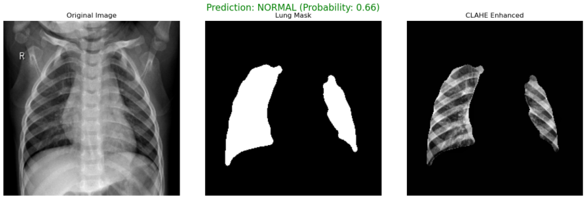
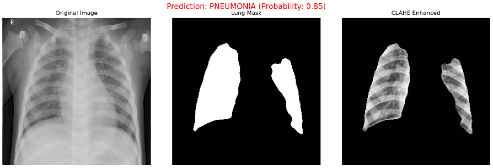

# 🫁 Pneumonia Detector

**X-ray 폐 영역 분할 및 이미지 프로세싱 기반의 경량 폐렴 진단 시스템**

---

## 🎯 문제 정의

폐렴은 조기 진단이 중요한 질환으로, X-ray 영상 기반 분석이 많이 활용되고 있습니다. 본 프로젝트는 비교적 경량한 모델(U-Net + Random Forest)을 기반으로, 이미지 전처리 중심의 분석으로 폐렴 여부를 예측하는 시스템을 설계하는 것을 목표로 합니다.

이 시스템은 복잡한 엔드투엔드 딥러닝 대신, 전처리 및 시각적 특징 추출을 통한 명확한 분류 기준 확보에 중점을 둡니다.

---

## 📌 프로젝트 개요

본 프로젝트는 Chest X-ray 이미지에서 폐 영역을 분할(U-Net 기반), 해당 영역의 시각적 특징(밝기, 윤곽선, 질감 등)을 추출한 후, 경량 분류기(Random Forest)를 통해 폐렴 여부를 예측하는 전처리 중심의 진단 보조 시스템입니다.

* 본 프로젝트는 [Kaggle의 U-Net Lung Segmentation Weights](https://www.kaggle.com/datasets/farhanhaikhan/unet-lung-segmentation-weights-for-chest-x-rays)에서 제공된 사전학습된 가중치를 사용하였습니다.

---

## 🛠 사용 기술

* Python 3, TensorFlow 2, OpenCV, scikit-learn
* U-Net 기반 폐 분할 모델
* CLAHE, Canny Edge, GLCM, LBP 등 전통적 컴퓨터 비전 기법
* Random Forest 기반 경량 분류기
* Tkinter 기반 GUI 예측 인터페이스

---

## 🧠 주요 구성

```
Pneumonia_Detector/
├── data/                      # X-ray 이미지 및 feature_data.csv 저장
│   ├── NORMAL/
│   └── PNEUMONIA/
├── models/                   # 사전학습된 U-Net 모델 및 Random Forest 모델 저장
│   ├── cxr_reg_weights.best.hdf5
│   ├── pneumonia_rf_model.pkl
│   └── scaler.pkl
├── image_loader.py           # 이미지 폴더 로딩 (OpenCV 활용)
├── segmentation.py           # U-Net 구조 기반 폐 영역 분할 (TensorFlow + OpenCV + skimage)
├── feature_extraction.py     # CLAHE, Canny, GLCM, LBP 등 기반 특징 추출
├── classification.py         # GridSearchCV + Random Forest 학습 및 평가
├── pneumonia_detector.py     # tkinter 기반 GUI 및 전체 추론 파이프라인 실행
├── screenshots/              # 예측 결과 및 마스크 예시 이미지
└── README.md                 # 본 문서
```

---

## 🔍 주요 기능

### 1. 폐 영역 분할 (Segmentation)

* **U-Net** 구조를 사용하여 X-ray 이미지의 양쪽 폐 영역을 마스킹
* `cv2.connectedComponentsWithStats`를 사용하여 주요 연결 성분만 추출
* `skimage.morphology` 기반의 morphological operation으로 노이즈 제거 및 형태 보정

### 2. 이미지 특징 추출 (Feature Extraction)

* **CLAHE (Contrast Limited Adaptive Histogram Equalization)** 를 통한 대비 향상
* 밝기 평균/표준편차, 폐 영역 비율 등 **기초 통계 수치**
* **Canny Edge Detection** 기반의 윤곽선 밀도
* **GLCM (Gray Level Co-occurrence Matrix)** 기반 질감 분석 (contrast, homogeneity)
* **LBP (Local Binary Pattern)** 기반 좌우 질감 비대칭성 및 entropy 차이 계산

### 3. 폐렴 분류 (Classification)

* 특징 기반의 **Random Forest** 이진 분류기 학습
* **GridSearchCV** 를 통한 하이퍼파라미터 튜닝 수행
* 확률 기반 분류로 Threshold 조절 가능 (예: 0.75 이상이면 폐렴)

### 4. GUI 기반 예측 (Optional)

* **tkinter** 기반의 이미지 선택 인터페이스
* 선택된 이미지에 대해 분할/처리 결과 시각화 (원본, 마스크, CLAHE 적용 결과)

---

## 🧪 모델 성능

| 지표             | NORMAL | PNEUMONIA | 전체        |
| -------------- | ------ | --------- | --------- |
| 정확도(Accuracy)  | 0.82   | 0.90      | **88.0%** |
| 정밀도(Precision) | 0.74   | 0.93      | -         |
| 재현율(Recall)    | 0.82   | 0.90      | -         |
| F1-score       | 0.78   | 0.92      | -         |
| ROC AUC        | -      | -         | **0.93**  |

> 테스트 데이터 기준, 분류 threshold = 0.6 사용 시

**📊 혼동 행렬 (Confusion Matrix)**


---

## 💻 실행 방법

### 1. 폐렴 예측 실행

```bash
python pneumonia_detector.py
```

> 실행 후 X-ray 이미지 선택 → 결과 예측 및 시각화

예시 결과:

* NORMAL 예측

  

* PNEUMONIA 예측

  

### 2. 특징 추출 및 모델 학습

```bash
# 특징 추출 후 CSV 생성 (data/NORMAL, data/PNEUMONIA 내 이미지 대상으로 수행)
python feature_extraction.py

# 생성된 feature_data.csv 기반으로 모델 학습 및 저장
python classification.py
```

#### 📂 각 코드 설명

* `image_loader.py` : OpenCV 기반으로 이미지 폴더에서 X-ray 파일 불러오기
* `segmentation.py` : U-Net 모델 정의 및 `apply_lung_mask()` 함수 제공 (TensorFlow 기반)
* `feature_extraction.py` : CLAHE 대비 향상, Canny 엣지 검출, GLCM 텍스처 분석, LBP 엔트로피 등 시각적 특징 추출 및 CSV 저장
* `classification.py` : Scikit-learn 기반의 Random Forest 학습 및 GridSearchCV 평가 → 모델 및 scaler 저장
* `pneumonia_detector.py` : Tkinter로 GUI 창 띄우고 이미지 선택 후 예측 결과 및 마스크, 전처리 결과 시각화

---

## 📦 Requirements

아래 패키지들이 설치되어 있어야 합니다:

```bash
pip install numpy pandas opencv-python scikit-learn scikit-image matplotlib seaborn joblib tensorflow
```

---

## 💡 활용 가능성

* 개인이 가진 X-ray 이미지로 간편하게 폐렴 여부를 확인해볼 수 있음
* 대형 모델 없이도 의미 있는 진단 성능을 얻을 수 있어 저사양 환경에 적합함
* 의료 도우미 챗봇, 모바일 진단 앱 등 다양한 곳에 내장 가능

---

## 🔮 향후 개선 방향

* 현재는 단일 X-ray 이미지 기반 분석 → 향후 시간 순 영상 혹은 CT 확장 가능
* 폐 외 다른 흉부 구조 반영 또는 다중 질환 분류 가능성
* 모바일 혹은 웹 기반 진단 도구로 확장 고려

---

## 🔗 참고

* [Kaggle: Chest X-ray Dataset](https://www.kaggle.com/datasets/paultimothymooney/chest-xray-pneumonia)
* [U-Net Paper](https://arxiv.org/abs/1505.04597)
* [U-Net Pretrained Weights](https://www.kaggle.com/datasets/farhanhaikhan/unet-lung-segmentation-weights-for-chest-x-rays)

---

## 👨‍💻 제작자

* **tmddn0920** (Seung Rain)

---

**🧬 작은 X-ray 한 장에서 시작된 진단 혁신.**
